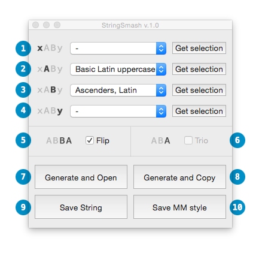

# StringSmash v.1.0

(Apr 27, 2015)

StringSmash is a simple RoboFont extension/Glyphs App script to generate strings for spacing/kerning. It can generate and open / save string of A+B pairs using elements of left and right lists.

**Note:** I've been using the basic script without any GUI for a while now in different forms and while it served me well there may be bugs (come on, there always are). Please use and report any bugs [here](mailto:hello@belafrank.com).

# Interface Elements

## List Setup

**1) Left delimiter**

Specify the left delimiter either choosing one of the presets or get the currently selected glyphs.

**2) Left list**

Specify the left list either choosing one of the presets or get the currently selected glyphs.

**3) Right list**

Specify the right list either choosing one of the presets or get the currently selected glyphs.

**4) Right delimiter**

Specify the right delimiter either choosing one of the presets or get the currently selected glyphs.

## Options

**5) Flip**

Instead of generating A+B pairs using elements of left and right lists, it creates A+B and B+A pairs.

**6) Trio**

Instead of generating A+B pairs using elements of left and right lists, it creates A+B+A pairs.

## Generate and Open / Save

**7) Generate and Open**

Generates the string and opens it up in a RoboFont SpaceCenter or in a Glyphs tab.

**8) Generate and Copy**

Generates the string and copies it onto the Clipboard.

**9) Save String**

Generates the string and saves it into a time-stamped .txt file next to the UFO file or if there's no file open in the editor than onto the user's Desktop. At least the left list (2) and right list (3) have to be set.

**10) Save MM Style**

Generates the string and saves it into a time-stamped MetricsMachine-style .txt file next to the UFO file or if there's no file open in tghe editor than onto the user's Desktop. At least the left list (2) and right list (3) have to be set.

**Note**

(7) and (8) requires at least one list and both delimiters set.  
 (9) requires at least two strings.  
 (10) requires only two lists (delimiters are omitted).

* * *

Béla Frank 2015  
 [http://belafrank.com](http://belafrank.com)  
 [hello@belafrank.com](mailto:hello@belafrank.com)
